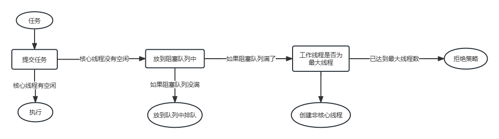
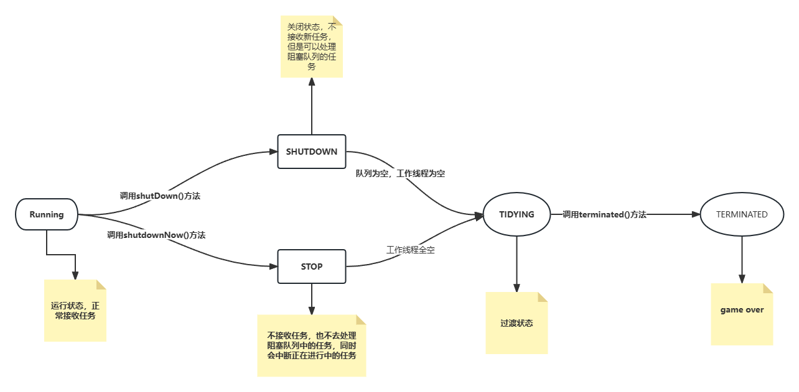

# 1、java 构建线程池的方式

- 继承 Thread
- 实现 Runnable
- 实现 callable
- 线程池方式（java 提供了构建线程池的方法）
  java 提供了 Executors 可以去创建（规范中不允许使用这种方式去创建线程池，这种方式对线程的控制粒度比较低）
  推荐手动创建

# 2、线程池的七个参数

**ThreadPoolExecutor**

```
public ThreadPoolExecutor(int corePoolSize,
                          int maximumPoolSize,
                          long keepAliveTime,
                          TimeUnit unit,
                          BlockingQueue<Runnable> workQueue,
                          ThreadFactory threadFactory,
                          RejectedExecutionHandler handler){}
```

**构造函数参数的含义如下：**

- corePoolSize：线程池中保持的核心线程数，即使线程处于空闲状态也不会被回收。
- maximumPoolSize：线程池中允许存在的最大线程数，包括核心线程和非核心线程。
- keepAliveTime：非核心线程空闲时的存活时间，超过这个时间会被回收。
- unit：keepAliveTime 参数的时间单位，例如 TimeUnit.SECONDS。
- workQueue：用于保存等待执行的任务的阻塞队列。
- threadFactory：用于创建新线程的工厂。
- handler：当线程池和任务队列都已满，无法执行新任务时，定义了拒绝策略的处理器。
  **通过使用这个构造函数，可以自定义线程池的各个参数，从而满足特定需求。**
  **需要注意的是，ThreadPoolExecutor 是 ExecutorService 接口的实现类，因此创建的线程池对象可以直接使用 ExecutorService 接口中定义的方法来执行和管理任务。**

# 3、线程池的执行流程



**为什么要先阻塞再去尝试创建非核心线程**
饭店（线程池）——>厨子（线程）——>人多先排队（阻塞队列）——>招厨子（创建最大线程数）——>今日客满（拒绝）

# 4、线程池的属性标识

## 4.1 核心属性

```java
    //AtomicInteger 是一个int类型的数值，1：声明当前线程池的状态；2：声明线程池中的状态；
    //高3位：是线程池状态   低29位是：线程池中的线程个数
    private final AtomicInteger ctl = new AtomicInteger(ctlOf(RUNNING, 0));
    private static final int COUNT_BITS = Integer.SIZE - 3;//29   方便后面做位运算     integer占32位
    private static final int CAPACITY   = (1 << COUNT_BITS) - 1;//通过位运算得出最大容量

    // runState is stored in the high-order bits
    private static final int RUNNING    = -1 << COUNT_BITS;//111  代表正常接收任务
    private static final int SHUTDOWN   =  0 << COUNT_BITS;//000  代表线程池为shutdown状态，不接收任务，但是内部还会处理阻塞队列中的任务，正在进行的任务也会处理;
    private static final int STOP       =  1 << COUNT_BITS;//001  代表线程池为stop状态。不接收任务，也不去处理阻塞队列中的任务，同时会中断正在进行中的任务;
    private static final int TIDYING    =  2 << COUNT_BITS;//010  代表线程池为tidying状态，过渡的状态，代表当前线程池即将game over;
    private static final int TERMINATED =  3 << COUNT_BITS;//011  代表线程池为terminated状态,要执行terminated（）方法，线程池真正的结束了;

    // Packing and unpacking ctl
    private static int runStateOf(int c)     { return c & ~CAPACITY; }//得到线程池的状态
    private static int workerCountOf(int c)  { return c & CAPACITY; }//得到当前线程池的线程数量（正在工作的线程）
    private static int ctlOf(int rs, int wc) { return rs | wc; }

```

## 4.2 线程池状态变化



# 5、线程池的 execute 方法的执行

```java
 public void execute(Runnable command) {

        if (command == null)  throw new NullPointerException();

        int c = ctl.get();//拿到32位的int

        //获取工作线程的个数<核心线程数
        if (workerCountOf(c) < corePoolSize) {
            //进到if,代表可以创建核心线程的个数
            if (addWorker(command, true))
            /* 到这结束 */
                return;

           /* 如果if没进去，代表获取核心线程数失败，重新获取ctl */
            c = ctl.get();
        }
        /* 判断线程池是否running状态，将任务添加到阻塞队列中 */
        if (isRunning(c) && workQueue.offer(command)) {
          /* 再次获取ctl */
            int recheck = ctl.get();
            /* 再次判断是否running状态 ，如果不是runnning，移除任务*/
            if (! isRunning(recheck) && remove(command))
                reject(command);
                /* 如果线程池处在running状态，但是工作线程为0 */
            else if (workerCountOf(recheck) == 0)
                addWorker(null, false);//阻塞队列有任务，但是没有工作线程，添加一个任务为空的工作线程处理阻塞队列中的任务
        }
        /* 创建非核心线程，处理任务*/
        else if (!addWorker(command, false))
            reject(command);//拒绝
    }

```

## 5.1 addWorker()方法内部做了什么处理

```java

    private boolean addWorker(Runnable firstTask, boolean core) {
     //这retry就是一个标记，标记对一个循环方法的操作（continue和break）处理点，功能类似于goto，所以retry一般都是伴随着for循环出现，retry:标记的下一行就是for循环，在for循环里面调用continue（或者break）再紧接着retry标记时，就表示从这个地方开始执行continue（或者break）操作
        retry:
        /* 目的：经过大量的判断，给工作线程数标识+1 */
        for (;;) {
            int c = ctl.get();//获取ctl
            int rs = runStateOf(c);//获取线程池状态

             /*除了running都有可能，running是-1  */
            // Check if queue empty only if necessary.
            if (rs >= SHUTDOWN &&
                ! (rs == SHUTDOWN &&
                   firstTask == null &&
                   ! workQueue.isEmpty()))
               //rs=SHUTDOWN，如果不是shutdown,就代表是stop或者更高状态，这时，不需要添加线程处理任务
               //任务为空，如果任务为null，并且线程池不是running，不需要处理
               //阻塞队列不为null，如果阻塞队列为空。返回false，外侧的！再次取反，获取true，不需要处理

               //构建工作线程失败
                return false;

            for (;;) {

               /* 获取线程池个数 */
                int wc = workerCountOf(c);
                if (wc >= CAPACITY ||   //如果当前线程大于当前线程池最大容量，不去创建了
                    wc >= (core ? corePoolSize : maximumPoolSize)) //判断wc是否超过核心线程或者最大线程
                    /* 构件工作线程失败 */
                    return false;
                    /* 将工作线程数+1,采用CAS的方式 */
                if (compareAndIncrementWorkerCount(c))
                /* 退出外侧for循环 */
                    break retry;
                c = ctl.get();  // Re-read ctl
                /* 重新判断线程池状态，如果有变化，结束这次外侧循环，开始下次外侧循环，如果状态没变化，重新执行内测循环即可 */
                if (runStateOf(c) != rs)
                    continue retry;
                // else CAS failed due to workerCount change; retry inner loop
            }
        }

        boolean workerStarted = false;//worker开始为false
        boolean workerAdded = false;//worker添加为false
        //worker就是工作线程
        Worker w = null;
        try {
          /* 创建woeker,创建任务 */
            w = new Worker(firstTask);
            /* 从worker获取工作t */
            final Thread t = w.thread;
            //如果线程不为null
            if (t != null) {
               //获取线程池的全局锁，避免我添加任务时，其他任务干掉线程池，干掉线程池需要先获取这个锁
                final ReentrantLock mainLock = this.mainLock;
                //加锁
                mainLock.lock();
                try {
                    // Recheck while holding lock.
                    // Back out on ThreadFactory failure or if
                    // shut down before lock acquired.
                    //获取线程池状态
                    int rs = runStateOf(ctl.get());
                    
                    //如果是running状态 或者状态是shutdown状态，创建空任务工作状态，处理阻塞队列中的任务
                    if (rs < SHUTDOWN ||
                        (rs == SHUTDOWN && firstTask == null)) {
                        if (t.isAlive()) // precheck that t is startable//线程是否运行状态
                            throw new IllegalThreadStateException();
                            /* 将工作线程添加到线程 */
                        workers.add(w);
                        int s = workers.size();//获取工作线程个数
                        /* 如果线程工作线程数大于之前记录的最大线程数，就替换一下*/
                        if (s > largestPoolSize)
                            largestPoolSize = s;
                        workerAdded = true;//添加工作线程成功
                    }
                } finally {
                    mainLock.unlock();//释放锁
                }
                if (workerAdded) {
                    t.start();//启动工作线程
                    workerStarted = true;//启动工作线程成功
                }
            }
        } finally {
          /* 如果启动工作线程失败，调用下面方法 */
            if (! workerStarted)
                addWorkerFailed(w);
        }
        //返回工作启动的状态
        return workerStarted;
    }


```

# 6、Worker 的封装

## worker方法

```java
final void runWorker(Worker w) {
        /* 获取当前线程 */
        Thread wt = Thread.currentThread();
        /* 拿到任务 */
        Runnable task = w.firstTask;
        w.firstTask = null;
        w.unlock(); // allow interrupts
        boolean completedAbruptly = true;
        try {
            /* 如果任务为空，从阻塞队列中获取任务 */
            while (task != null || (task = getTask()) != null) {
                w.lock();//加锁，避免任务不会被中断
                // If pool is stopping, ensure thread is interrupted;
                // if not, ensure thread is not interrupted.  This
                // requires a recheck in second case to deal with
                // shutdownNow race while clearing interrupt
                if ((runStateAtLeast(ctl.get(), STOP) ||//判断当前线程是否大于等于stop，悲剧！
                     (Thread.interrupted() &&
                      runStateAtLeast(ctl.get(), STOP))) &&
                    !wt.isInterrupted())
                    wt.interrupt();
                try {
                    //执行任务前的操作
                    beforeExecute(wt, task);
                    Throwable thrown = null;
                    try {
                         //开始执行任务
                        task.run();
                    } catch (RuntimeException x) {
                        thrown = x; throw x;
                    } catch (Error x) {
                        thrown = x; throw x;
                    } catch (Throwable x) {
                        thrown = x; throw new Error(x);
                    } finally {
                         //执行任务后的操作
                        afterExecute(task, thrown);
                    }
                } finally {
                    task = null;
                    w.completedTasks++;
                    w.unlock();
                }
            }
            completedAbruptly = false;
        } finally {
            processWorkerExit(w, completedAbruptly);
        }
    }

```


# 7、线程执行的后续处理

## 方法详细信息

1. **newFixedThreadPool**
   **public static ExecutorService newFixedThreadPool(int nThreads)创建一个线程池，该线程池重用固定数量的从共享无界队列中运行的线程。 在任何时候，最多 nThreads 线程将处于主动处理任务。 如果所有线程处于活动状态时都会提交其他任务，则它们将等待队列中直到线程可用。 如果任何线程由于在关闭之前的执行期间发生故障而终止，则如果需要执行后续任务，则新线程将占用它。 池中的线程将存在，直到它明确地为 shutdown 。**

- 参数
  nThreads - 池中的线程数
- 结果
  新创建的线程池
- 异常
  IllegalArgumentException - 如果是 nThreads <= 0

2. **newWorkStealingPool**
   **public static ExecutorService newWorkStealingPool(int parallelism)创建一个维护足够的线程以支持给定的并行级别的线程池，并且可以使用多个队列来减少争用。 并行级别对应于主动参与或可以从事任务处理的最大线程数。 线程的实际数量可以动态增长和收缩。 工作窃取池不保证执行提交的任务的顺序。**

- 参数
  parallelism - 目标平行度水平
- 结果
  新创建的线程池
- 异常
  IllegalArgumentException - 如果是 parallelism <= 0

3. **newWorkStealingPool**
   **public static ExecutorService newWorkStealingPool()使用所有 available processors 作为其目标并行级别创建一个工作窃取线程池。**

4. **newFixedThreadPool**
   **public static ExecutorService newFixedThreadPool(int nThreads,ThreadFactory threadFactory)创建一个线程池，重用固定数量的线程，从共享无界队列中运行，使用提供的 ThreadFactory 在需要时创建新线程。 在任何时候，最多 nThreads 个线程将处于主动处理任务。 如果所有线程处于活动状态时都会提交其他任务，则它们将等待队列中直到线程可用。 如果任何线程由于在关闭之前的执行期间发生故障而终止，则如果需要执行后续任务，则新线程将占用它。 池中的线程将存在，直到它明确地为 shutdown**

- 参数
  nThreads - 池中的线程数
  threadFactory - 工厂在创建新线程时使用
- 结果
  新创建的线程池
- 异常
  NullPointerException - 如果 threadFactory 为 null
  IllegalArgumentException - 如果是 nThreads <= 0

5. **newSingleThreadExecutor**
   **public static ExecutorService newSingleThreadExecutor()创建一个使用从无界队列运行的单个工作线程的执行程序。 （请注意，如果这个单个线程由于在关闭之前的执行过程中发生故障而终止，则如果需要执行后续任务，则新的线程将占用它。）任务保证顺序执行，并且不超过一个任务将被激活在任何给定的时间。 与其他等效的 newFixedThreadPool(1) newFixedThreadPool(1) ，返回的执行器保证不被重新配置以使用额外的线程。**

- 结果
  新创建的单线程执行器

6. **newSingleThreadExecutor**
   **public static ExecutorService newSingleThreadExecutor(ThreadFactory threadFactory)创建一个使用单个工作线程运行无界队列的执行程序，并在需要时使用提供的 ThreadFactory 创建一个新线程。 与其他等效的 newFixedThreadPool(1, threadFactory) newFixedThreadPool(1, threadFactory) ，返回的执行器保证不被重新配置以使用额外的线程。**

- 参数
  threadFactory - 工厂在创建新线程时使用
- 结果
  新创建的单线程执行器
- 异常
  NullPointerException - 如果 threadFactory 为 null

6. **newCachedThreadPool**
   **public static ExecutorService newCachedThreadPool()创建一个根据需要创建新线程的线程池，但在可用时将重新使用以前构造的线程。 这些池通常会提高执行许多短暂异步任务的程序的性能。 调用 execute 将重用以前构造的线程（如果可用）。 如果没有可用的线程，将创建一个新的线程并将其添加到该池中。 未使用六十秒的线程将被终止并从缓存中删除。 因此，长时间保持闲置的池将不会消耗任何资源。 请注意，可以使用 ThreadPoolExecutor 构造函数创建具有相似属性但不同详细信息的池（例如，超时参数）。**

- 结果
  新创建的线程池

7. **newCachedThreadPool**
   **public static ExecutorService newCachedThreadPool(ThreadFactory threadFactory)创建一个根据需要创建新线程的线程池，但在可用时将重新使用以前构造的线程，并在需要时使用提供的 ThreadFactory 创建新线程。**

- 参数
  threadFactory - 创建新线程时使用的工厂
- 结果
  新创建的线程池
- 异常
  NullPointerException - 如果 threadFactory 为 null

8. **newSingleThreadScheduledExecutor**
   **public static ScheduledExecutorService newSingleThreadScheduledExecutor()创建一个单线程执行器，可以调度命令在给定的延迟之后运行，或定期执行。 （请注意，如果这个单个线程由于在关闭之前的执行过程中发生故障而终止，则如果需要执行后续任务，则新的线程将占用它。）任务保证顺序执行，并且不超过一个任务将被激活在任何给定的时间。 与其他等效的 newScheduledThreadPool(1) newScheduledThreadPool(1) ，返回的执行器保证不被重新配置以使用额外的线程。**

- 结果
  新创建的预定执行者

9. **newSingleThreadScheduledExecutor**
   **public static ScheduledExecutorService newSingleThreadScheduledExecutor(ThreadFactory threadFactory)创建一个单线程执行器，可以调度命令在给定的延迟之后运行，或定期执行。 （请注意，如果这个单个线程由于在关闭之前的执行过程中发生故障而终止，则如果需要执行后续任务，则新的线程将占用它。）任务保证顺序执行，并且不超过一个任务将被激活在任何给定的时间。 与其他等效的 newScheduledThreadPool(1, threadFactory) newScheduledThreadPool(1, threadFactory) ，返回的执行器保证不被重新配置以使用额外的线程。**

- 参数
  threadFactory - 创建新线程时使用的工厂
- 结果
  一个新创建的预定执行者
- 异常
  NullPointerException - 如果 threadFactory 为 null

10. **newScheduledThreadPool**
    **public static ScheduledExecutorService newScheduledThreadPool(int corePoolSize)创建一个线程池，可以调度命令在给定的延迟之后运行，或定期执行。**

- 参数
  corePoolSize - 要保留在池中的线程数，即使它们处于空闲状态
- 结果
  一个新创建的线程池
- 异常
  IllegalArgumentException - 如果是 corePoolSize < 0

11. **newScheduledThreadPool**
    **public static ScheduledExecutorService newScheduledThreadPool(int corePoolSize,ThreadFactory threadFactory)创建一个线程池，可以调度命令在给定的延迟之后运行，或定期执行。**

- 参数
  corePoolSize - 要保留在池中的线程数，即使它们处于空闲状态
  threadFactory - 执行程序创建新线程时使用的工厂
- 结果
  一个新创建的线程池
- 异常
  IllegalArgumentException - 如果是 corePoolSize < 0
  NullPointerException - 如果 threadFactory 为 null

12. **unconfigurableExecutorService**
    **public static ExecutorService unconfigurableExecutorService(ExecutorService executor)返回一个将所有定义的 ExecutorService 方法委托给给定执行程序的对象，但不会使用任何其他可能使用转换访问的方法。 这提供了一种安全地“冻结”配置并且不允许调整给定的具体实现的方法。**

- 参数
  executor - 底层实现
- 结果
  一个 ExecutorService 例子
- 异常
  NullPointerException - 如果执行器为空

13. **unconfigurableScheduledExecutorService**
    **public static ScheduledExecutorService unconfigurableScheduledExecutorService(ScheduledExecutorService executor)返回一个将所有定义的 ScheduledExecutorService 方法委托给给定执行程序的对象，但不能以其他方式使用转换方式访问。 这提供了一种安全地“冻结”配置并且不允许调整给定的具体实现的方法。**

- 参数
  executor - 底层实现
- 结果
  一个 ScheduledExecutorService 实例
- 异常
  NullPointerException - 如果执行者为空

14. **defaultThreadFactory**
    **public static ThreadFactory defaultThreadFactory()返回用于创建新线程的默认线程工厂。 该工厂在同一个 ThreadGroup 中创建了 Executor 使用的所有新线程。 如果有一个 SecurityManager ，它使用组 System.getSecurityManager() ，否则该组的线程调用这个 defaultThreadFactory 方法。 每个新线程被创建为非守护线程，优先级设置为 Thread.NORM_PRIORITY 中的较小者，线程组中允许的最大优先级。 新线程具有可通过访问名字 Thread.getName() 池-N-thread-M 的 ，其中 N 是此工厂的序列号，M 是此工厂所创建线程的序列号。**

- 结果
  线工厂
