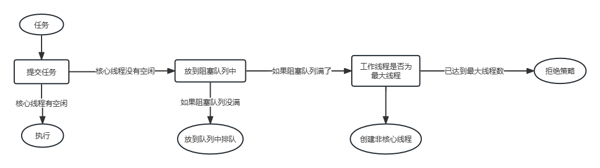
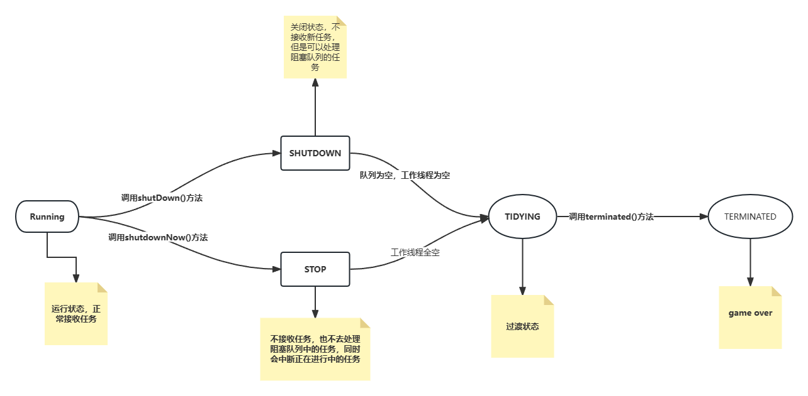

# 1、java构建线程池的方式
- 继承Thread
- 实现Runnable
- 实现callable
- 线程池方式（java提供了构建线程池的方法）
    java提供了Executors可以去创建（规范中不允许使用这种方式去创建线程池，这种方式对线程的控制粒度比较低）
    推荐手动创建

# 2、线程池的七个参数
**ThreadPoolExecutor**
```
public ThreadPoolExecutor(int corePoolSize,
                          int maximumPoolSize,
                          long keepAliveTime,
                          TimeUnit unit,
                          BlockingQueue<Runnable> workQueue,
                          ThreadFactory threadFactory,
                          RejectedExecutionHandler handler){}
```
**构造函数参数的含义如下：**

- corePoolSize：线程池中保持的核心线程数，即使线程处于空闲状态也不会被回收。
- maximumPoolSize：线程池中允许存在的最大线程数，包括核心线程和非核心线程。
- keepAliveTime：非核心线程空闲时的存活时间，超过这个时间会被回收。
- unit：keepAliveTime参数的时间单位，例如TimeUnit.SECONDS。
- workQueue：用于保存等待执行的任务的阻塞队列。
- threadFactory：用于创建新线程的工厂。
- handler：当线程池和任务队列都已满，无法执行新任务时，定义了拒绝策略的处理器。
**通过使用这个构造函数，可以自定义线程池的各个参数，从而满足特定需求。**
**需要注意的是，ThreadPoolExecutor是ExecutorService接口的实现类，因此创建的线程池对象可以直接使用ExecutorService接口中定义的方法来执行和管理任务。**

# 3、线程池的执行流程



**为什么要先阻塞再去尝试创建非核心线程**
 饭店（线程池）——>厨子（线程）——>人多先排队（阻塞队列）——>招厨子（创建最大线程数）——>今日客满（拒绝）


# 4、线程池的属性标识

## 4.1核心属性
```java
    //AtomicInteger 是一个int类型的数值，1：声明当前线程池的状态；2：声明线程池中的状态；
    //高3位：是线程池状态   低29位是：线程池中的线程个数
    private final AtomicInteger ctl = new AtomicInteger(ctlOf(RUNNING, 0));
    private static final int COUNT_BITS = Integer.SIZE - 3;//29   方便后面做位运算     integer占32位
    private static final int CAPACITY   = (1 << COUNT_BITS) - 1;//通过位运算得出最大容量

    // runState is stored in the high-order bits
    private static final int RUNNING    = -1 << COUNT_BITS;//111  代表正常接收任务
    private static final int SHUTDOWN   =  0 << COUNT_BITS;//000  代表线程池为shutdown状态，不接收任务，但是内部还会处理阻塞队列中的任务，正在进行的任务也会处理;
    private static final int STOP       =  1 << COUNT_BITS;//001  代表线程池为stop状态。不接收任务，也不去处理阻塞队列中的任务，同时会中断正在进行中的任务;
    private static final int TIDYING    =  2 << COUNT_BITS;//010  代表线程池为tidying状态，过渡的状态，代表当前线程池即将game over;
    private static final int TERMINATED =  3 << COUNT_BITS;//011  代表线程池为terminated状态,要执行terminated（）方法，线程池真正的结束了;

    // Packing and unpacking ctl
    private static int runStateOf(int c)     { return c & ~CAPACITY; }//得到线程池的状态
    private static int workerCountOf(int c)  { return c & CAPACITY; }//得到当前线程池的线程数量（正在工作的线程）
    private static int ctlOf(int rs, int wc) { return rs | wc; }

```

## 4.2线程池状态变化


# 5、线程池的execute方法的执行

```java
 public void execute(Runnable command) {

        if (command == null)  throw new NullPointerException();

        int c = ctl.get();//拿到32位的int

        //获取工作线程的个数<核心线程数
        if (workerCountOf(c) < corePoolSize) {
            //进到if,代表可以创建核心线程的个数
            if (addWorker(command, true))
                return;
            c = ctl.get();
        }
        if (isRunning(c) && workQueue.offer(command)) {
            int recheck = ctl.get();
            if (! isRunning(recheck) && remove(command))
                reject(command);
            else if (workerCountOf(recheck) == 0)
                addWorker(null, false);
        }
        else if (!addWorker(command, false))
            reject(command);
    }

```

# 6、Worker的封装


# 7、线程执行的后续处理


## 方法详细信息
1. **newFixedThreadPool**
**public static ExecutorService newFixedThreadPool(int nThreads)创建一个线程池，该线程池重用固定数量的从共享无界队列中运行的线程。 在任何时候，最多nThreads线程将处于主动处理任务。 如果所有线程处于活动状态时都会提交其他任务，则它们将等待队列中直到线程可用。 如果任何线程由于在关闭之前的执行期间发生故障而终止，则如果需要执行后续任务，则新线程将占用它。 池中的线程将存在，直到它明确地为shutdown 。** 
- 参数 
      nThreads - 池中的线程数 
- 结果 
      新创建的线程池 
- 异常 
      IllegalArgumentException - 如果是 nThreads <= 0 

2. **newWorkStealingPool**
**public static ExecutorService newWorkStealingPool(int parallelism)创建一个维护足够的线程以支持给定的并行级别的线程池，并且可以使用多个队列来减少争用。 并行级别对应于主动参与或可以从事任务处理的最大线程数。 线程的实际数量可以动态增长和收缩。 工作窃取池不保证执行提交的任务的顺序。** 
- 参数 
     parallelism - 目标平行度水平 
- 结果 
     新创建的线程池 
- 异常 
   IllegalArgumentException - 如果是 parallelism <= 0 

3. **newWorkStealingPool**
**public static ExecutorService newWorkStealingPool()使用所有 available processors作为其目标并行级别创建一个工作窃取线程池。** 

4. **newFixedThreadPool**
**public static ExecutorService newFixedThreadPool(int nThreads,ThreadFactory threadFactory)创建一个线程池，重用固定数量的线程，从共享无界队列中运行，使用提供的ThreadFactory在需要时创建新线程。 在任何时候，最多nThreads个线程将处于主动处理任务。 如果所有线程处于活动状态时都会提交其他任务，则它们将等待队列中直到线程可用。 如果任何线程由于在关闭之前的执行期间发生故障而终止，则如果需要执行后续任务，则新线程将占用它。 池中的线程将存在，直到它明确地为shutdown**
- 参数 
      nThreads - 池中的线程数 
      threadFactory - 工厂在创建新线程时使用 
- 结果 
      新创建的线程池 
- 异常 
      NullPointerException - 如果threadFactory为null 
      IllegalArgumentException - 如果是 nThreads <= 0 
5. **newSingleThreadExecutor**
**public static ExecutorService newSingleThreadExecutor()创建一个使用从无界队列运行的单个工作线程的执行程序。 （请注意，如果这个单个线程由于在关闭之前的执行过程中发生故障而终止，则如果需要执行后续任务，则新的线程将占用它。）任务保证顺序执行，并且不超过一个任务将被激活在任何给定的时间。 与其他等效的newFixedThreadPool(1) newFixedThreadPool(1) ，返回的执行器保证不被重新配置以使用额外的线程。** 
- 结果 
     新创建的单线程执行器 
6. **newSingleThreadExecutor**
**public static ExecutorService newSingleThreadExecutor(ThreadFactory threadFactory)创建一个使用单个工作线程运行无界队列的执行程序，并在需要时使用提供的ThreadFactory创建一个新线程。 与其他等效的newFixedThreadPool(1, threadFactory) newFixedThreadPool(1, threadFactory) ，返回的执行器保证不被重新配置以使用额外的线程。** 
- 参数 
    threadFactory - 工厂在创建新线程时使用 
- 结果 
    新创建的单线程执行器 
- 异常 
    NullPointerException - 如果threadFactory为null 
6. **newCachedThreadPool**
**public static ExecutorService newCachedThreadPool()创建一个根据需要创建新线程的线程池，但在可用时将重新使用以前构造的线程。 这些池通常会提高执行许多短暂异步任务的程序的性能。 调用execute将重用以前构造的线程（如果可用）。 如果没有可用的线程，将创建一个新的线程并将其添加到该池中。 未使用六十秒的线程将被终止并从缓存中删除。 因此，长时间保持闲置的池将不会消耗任何资源。 请注意，可以使用ThreadPoolExecutor构造函数创建具有相似属性但不同详细信息的池（例如，超时参数）。** 
- 结果 
     新创建的线程池 
7. **newCachedThreadPool**
**public static ExecutorService newCachedThreadPool(ThreadFactory threadFactory)创建一个根据需要创建新线程的线程池，但在可用时将重新使用以前构造的线程，并在需要时使用提供的ThreadFactory创建新线程。** 
- 参数 
     threadFactory - 创建新线程时使用的工厂 
- 结果 
     新创建的线程池 
- 异常 
     NullPointerException - 如果threadFactory为null 
8. **newSingleThreadScheduledExecutor**
**public static ScheduledExecutorService newSingleThreadScheduledExecutor()创建一个单线程执行器，可以调度命令在给定的延迟之后运行，或定期执行。 （请注意，如果这个单个线程由于在关闭之前的执行过程中发生故障而终止，则如果需要执行后续任务，则新的线程将占用它。）任务保证顺序执行，并且不超过一个任务将被激活在任何给定的时间。 与其他等效的newScheduledThreadPool(1) newScheduledThreadPool(1) ，返回的执行器保证不被重新配置以使用额外的线程。** 
- 结果 
     新创建的预定执行者 
9. **newSingleThreadScheduledExecutor**
**public static ScheduledExecutorService newSingleThreadScheduledExecutor(ThreadFactory threadFactory)创建一个单线程执行器，可以调度命令在给定的延迟之后运行，或定期执行。 （请注意，如果这个单个线程由于在关闭之前的执行过程中发生故障而终止，则如果需要执行后续任务，则新的线程将占用它。）任务保证顺序执行，并且不超过一个任务将被激活在任何给定的时间。 与其他等效的newScheduledThreadPool(1, threadFactory) newScheduledThreadPool(1, threadFactory) ，返回的执行器保证不被重新配置以使用额外的线程。** 
- 参数 
     threadFactory - 创建新线程时使用的工厂 
- 结果 
     一个新创建的预定执行者 
- 异常 
     NullPointerException - 如果threadFactory为null 
10. **newScheduledThreadPool**
**public static ScheduledExecutorService newScheduledThreadPool(int corePoolSize)创建一个线程池，可以调度命令在给定的延迟之后运行，或定期执行。** 
- 参数 
     corePoolSize - 要保留在池中的线程数，即使它们处于空闲状态 
- 结果 
     一个新创建的线程池 
- 异常 
     IllegalArgumentException - 如果是 corePoolSize < 0 
11. **newScheduledThreadPool**
**public static ScheduledExecutorService newScheduledThreadPool(int corePoolSize,ThreadFactory threadFactory)创建一个线程池，可以调度命令在给定的延迟之后运行，或定期执行。** 
- 参数 
     corePoolSize - 要保留在池中的线程数，即使它们处于空闲状态 
     threadFactory - 执行程序创建新线程时使用的工厂 
- 结果 
      一个新创建的线程池 
- 异常 
     IllegalArgumentException - 如果是 corePoolSize < 0 
     NullPointerException - 如果threadFactory为null 
12. **unconfigurableExecutorService**
**public static ExecutorService unconfigurableExecutorService(ExecutorService executor)返回一个将所有定义的ExecutorService方法委托给给定执行程序的对象，但不会使用任何其他可能使用转换访问的方法。 这提供了一种安全地“冻结”配置并且不允许调整给定的具体实现的方法。** 
- 参数 
     executor - 底层实现 
- 结果 
     一个 ExecutorService例子 
- 异常 
    NullPointerException - 如果执行器为空 
13. **unconfigurableScheduledExecutorService**
**public static ScheduledExecutorService unconfigurableScheduledExecutorService(ScheduledExecutorService executor)返回一个将所有定义的ScheduledExecutorService方法委托给给定执行程序的对象，但不能以其他方式使用转换方式访问。 这提供了一种安全地“冻结”配置并且不允许调整给定的具体实现的方法。** 
- 参数 
     executor - 底层实现 
- 结果 
     一个 ScheduledExecutorService实例 
- 异常 
     NullPointerException - 如果执行者为空 
14. **defaultThreadFactory**
**public static ThreadFactory defaultThreadFactory()返回用于创建新线程的默认线程工厂。 该工厂在同一个ThreadGroup中创建了Executor使用的所有新线程。 如果有一个SecurityManager ，它使用组System.getSecurityManager() ，否则该组的线程调用这个defaultThreadFactory方法。 每个新线程被创建为非守护线程，优先级设置为Thread.NORM_PRIORITY中的较小者，线程组中允许的最大优先级。 新线程具有可通过访问名字Thread.getName() 池-N-thread-M的 ，其中N是此工厂的序列号，M是此工厂所创建线程的序列号。** 
- 结果 
     线工厂 
