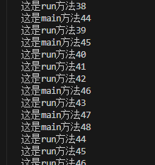

# Thread 、Runnable、Callable
```
三种创建方式

1、Thread.class    继承Thread类（实现了Runnable接口）
2、Runnable接口    实现Runnable接口（重点）
3、Callable接口    实现Callable接口（了解）

```
## 一、Thread
```
1、自定义线程类继承Thread类
2、重写run方法，编写线程执行体
3、创建线程对象，调用start方法启动线程

```
```
package MultiThreadedExplanation.Demo;

<!-- 总结：线程开启不一定立即执行，由cpu调度执行 -->

public class MyThread extends Thread {
    @Override
    public void run() {
       for(int i=0;i<100;i++){
        System.out.println("这是run方法"+i);
       }
    }

    public static void main(String [] args){

        MyThread myThread=new MyThread();
        myThread.start();

        for(int i=1;i<1000;i++){
            System.out.println("这是main方法"+i);
        }
    }

}

```
