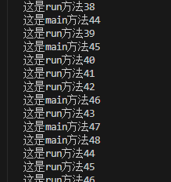

# Thread 、Runnable、Callable
```
三种创建方式

1、Thread.class    继承Thread类（实现了Runnable接口）
2、Runnable接口    实现Runnable接口（重点）
3、Callable接口    实现Callable接口（了解）

```
## 一、Thread
```
1、自定义线程类继承Thread类
2、重写run方法，编写线程执行体
3、创建线程对象，调用start方法启动线程

```
```
package MultiThreadedExplanation.Demo;

<!-- 总结：线程开启不一定立即执行，由cpu调度执行 -->

public class MyThread extends Thread {
    @Override
    public void run() {
       for(int i=0;i<100;i++){
        System.out.println("这是run方法"+i);
       }
    }

    public static void main(String [] args){

        MyThread myThread=new MyThread();
        myThread.start();

        for(int i=1;i<1000;i++){
            System.out.println("这是main方法"+i);
        }
    }

}

```



## 2、实现Runnable

```

1、定义MyRunnable类，实现Runnable接口；
2、实现run方法，编写线程执行体；
3、执行线程需要丢入runnable接口实现类，调用start方法启动线程；

```

```

public class RunnableDemo03 implements Runnable {
    @Override
    //run方法线程体
    public void run() {
        for (int i = 0; i < 100; i++) {
            System.out.println("这是run方法" + i);
        }
    }

    public static void main(String[] args) {
        //创建runnable接口的实现类对象
        RunnableDemo03 runnableDemo03 = new RunnableDemo03();


        Thread thread = new Thread(runnableDemo03);
        thread.start();
        //创建线程对象，通过线程对象来开启我们的线程代理
        for (int i = 1; i < 100; i++) {
            System.out.println("这是main方法" + i);
        }
    }

}

```

### 实现Callable接口

```
1、实现Callable接口，需要返回值类型；
2、重写call方法，需要抛出异常；
3、创建目标对象；
4、创建执行服务：ExecutorService ser=Executors.newFixedThreadPool(2);
5、提交执行：Future<Boolean> res1= ser.submit(t1);
6、获取结果：boolean r1=res1.get()
7、关闭服务：ser.shutdownNow()

```
```
public class CallableDemo05 implements Callable<Boolean> {
   private String url;
   private String name;

    public CallableDemo05(String url,String name ){
        this.url=url;
        this.name=name;
    }

    //实现call方法
    @Override
    public Boolean call() {
        downloader(url,name);
        System.out.println("文件名称为"+name+"下载了");
        return true;
    }

    public  void downloader(String url,String name){
        try {
            FileUtils.copyURLToFile(new URL(url),new File(name));
        } catch (IOException e) {
            e.printStackTrace();
        }
    }

    public static void main(String[] args) throws ExecutionException, InterruptedException {

        CallableDemo05 t1=new CallableDemo05("https://cn.bing.com/images/search?q=%E5%9B%BE%E7%89%87&FORM=IQFRBA&id=0BDF3A3289356D51A820116655965BB18DA73F04","文件1.jpg");
        CallableDemo05 t2=new CallableDemo05("https://cn.bing.com/images/search?q=%E5%9B%BE%E7%89%87&FORM=IQFRBA&id=7EB91D937DD64C42871BEC9DFA66DE7E3E8663D8","文件2.jpg");
        CallableDemo05 t3=new CallableDemo05("https://cn.bing.com/images/search?q=%E5%9B%BE%E7%89%87&FORM=IQFRBA&id=21679CBB0E9648E00603E35CB617428F7F6FB48B","文件3.jpg");

        //1、创建执行服务
        ExecutorService executorService= Executors.newFixedThreadPool(3);

        //2、提交执行
        Future<Boolean> r1=executorService.submit(t1);
        Future<Boolean> r2=executorService.submit(t2);
        Future<Boolean> r3=executorService.submit(t3);

        //3、获取结果
        boolean rs1 = r1.get();
        boolean rs2 = r2.get();
        boolean rs3 = r3.get();

        System.out.println(rs1);
        System.out.println(rs2);
        System.out.println(rs3);

       //4、关闭服务
        executorService.shutdownNow();
    }


}

```


### 小结

```
1、继承Thread类
    子类继承Thread类具备多线程能力；
    启动线程：子类对象.start
    不建议使用：避免OOP单继承局限性 
2、实现Runnable接口
    实现接口Runnable具有多线程能力；
    启动线程：传入目标对象+Thread对象.start()
    推荐使用：避免单继承局限性，灵活方便，方便同一个对象被多个线程使用
```
